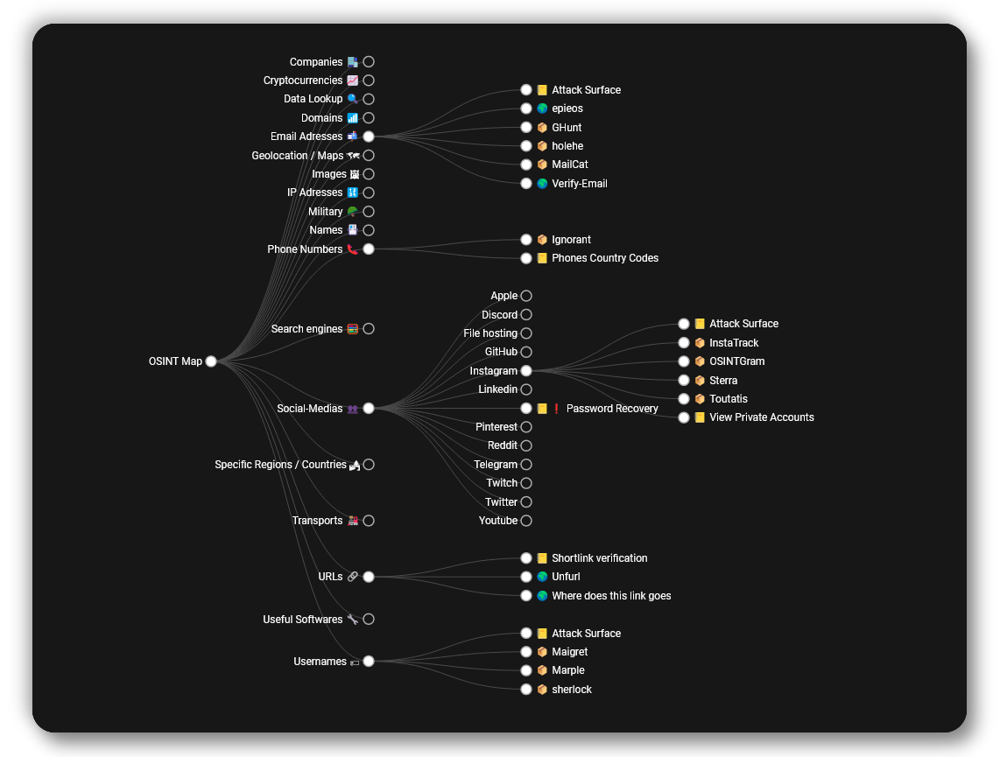

# 🔎O3T1W's OSINT Tools Map🗺

 

## [🗺 Available here VISIT TO VIEW THE MAP !](https://o3t1w.github.io/tree/)

[**O3T1W's OSINT Tree Map**](https://o3t1w.github.io/tree) is **an online OSINT tools mind map** of selected useful tools **made for OSINT** purposes,\
made to **help you during your investigations** 
👀``project was inspired and tweaked from https://github.com/Malfrats/OSINT-Map``

_It is an up-to-date and remastered version of osintframework.com, which isn't updated anymore._
## 📥 Add a tool
To add a tool to the map, follow [this guide](https://github.com/o3t1w/o3t1w.github.io/blob/main/tree/ADD.md).
## 🏁 Legend
Emoji | Meaning
:-: | :-:
📦 | **Requires installation**
💵 | **Useless without purchases**
🌍 | **Web-based**
📒 | **Guide, tutorial or documentation**
🪙 | **Useful tool even without purchases**
🧅 | **Leads to a `.onion` website**
🧩 | **Browser extension**
❗️ | **Offensive-OSINT that might alert the target**

